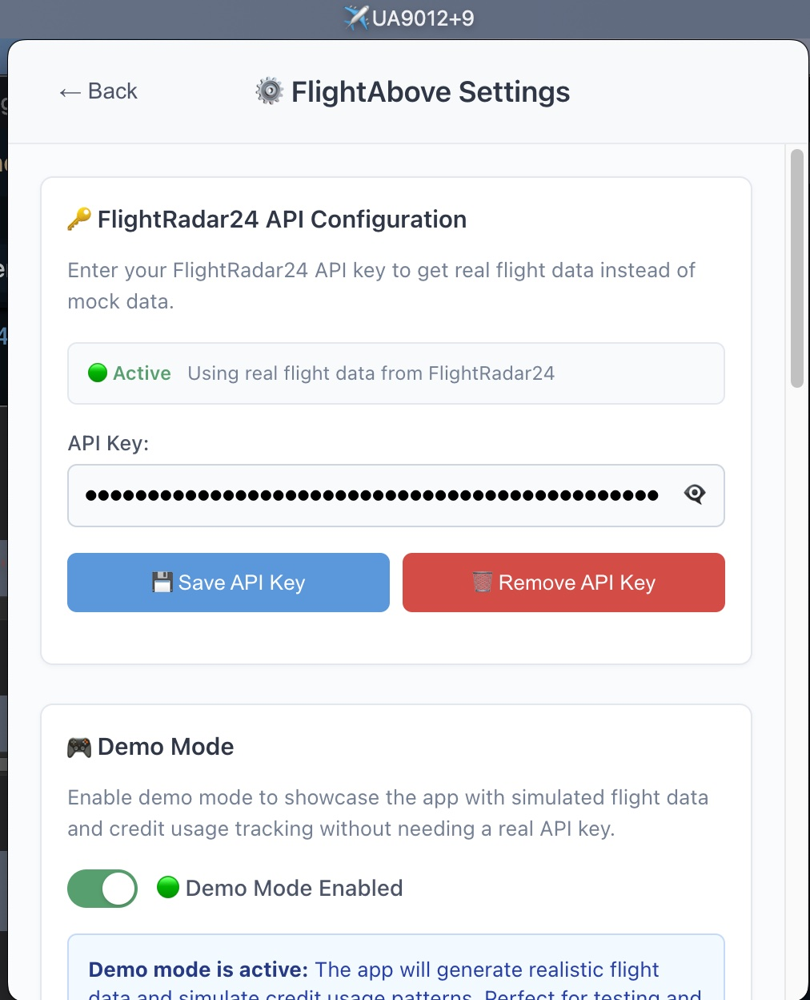

# FlightAbove

A modern macOS menu bar application that displays nearby aircraft with real-time flight information, comprehensive credit management, and a beautiful interface designed for aviation enthusiasts.


## 📖 Description

FlightAbove transforms your Mac's menu bar into a sophisticated aviation radar, showing you exactly what aircraft are flying nearby. With an elegant interface and comprehensive flight data, discover detailed information about flights overhead - from commercial airliners to private aircraft. Features intelligent credit management to optimize FlightRadar24 API costs while providing rich flight information.

**Perfect for aviation enthusiasts, frequent travelers, and anyone curious about the sky above them.**

## ✨ Screenshots

| Main Flight Display | Settings & Configuration |
|---------------------|-------------------------|
|  |  |

## 🚀 Key Features

### ✈️ Real-Time Flight Tracking
- **Smart Flight Detection**: Displays nearby aircraft within configurable radius (10-50km)
- **Multiple Flight Navigation**: Browse through detected flights with elegant navigation controls
- **Live Distance Calculation**: Shows exact distance to each aircraft with precision
- **Ultra-Fast Updates**: Configurable refresh intervals (1-60 minutes) including real-time 1-minute tracking

### 📸 Aircraft Image Display
- **Visual Aircraft Data**: Displays real-world images of detected aircraft fetched from JetAPI.
- **Interactive Carousel**: Navigate through multiple available images for a selected aircraft.
- **Contextual Information**: Image overlay shows location, date, and photographer on hover.
- **Clean UI**: Integrated navigation arrows and compact details provide a seamless viewing experience.

### 🎮 Demo Mode
- **Realistic Simulation**: Generates authentic flight data with *real aircraft registrations*.
- **Perfect for Testing**: Showcase features and test functionality without needing API keys.
- **Full Feature Access**: Complete functionality testing, including actual image fetching from the API.
- **Multiple Aircraft**: Demonstrates navigation with 2-4+ realistic flights.

### 🎯 Rich Flight Information
- **Comprehensive Data**: Flight number, airline, origin/destination airports (IATA codes)
- **Aircraft Details**: Full aircraft names (e.g., "Boeing KC-135T Stratotanker"), registration numbers
- **Real-Time Status**: Current position, altitude, speed, heading, flight status
- **Interactive Tooltips**: Hover over airport codes to see full airport names instantly
- **Smart Text Display**: Full airline and aircraft names with intelligent text wrapping

### 🏢 Airline Integration
- **Comprehensive Database**: 1,224+ airlines with professional logos from Kiwi.com
- **Global Coverage**: Major international and regional carriers (United, Air Canada, Lufthansa, Emirates, etc.)
- **Smart Fallbacks**: Graceful handling of missing logos and private aircraft
- **Real-Time Updates**: Automatic database refresh with 1-hour caching for performance

### 🖥️ Modern macOS Experience
- **Clean Design**: Minimalist interface with transparent background and elegant white cards
- **Sophisticated UI**: Polished cards, smooth animations, and intuitive navigation
- **Native Behavior**: Proper menu bar integration with click-away functionality
- **Optimal Layout**: Fixed 450px width for consistent display across all screen sizes
- **Responsive Content**: Intelligent text wrapping and layout adaptation for any flight data

### ⚙️ Advanced Configuration
- **Modern Settings Panel**: Redesigned interface with card-based layouts and visual indicators
- **Intelligent Warnings**: Real-time feedback for high-usage settings with optimization tips
- **Flight Visibility Guide**: Built-in guidelines for optimal aircraft spotting configurations
- **Flexible Refresh Options**: 1-minute real-time to 60-minute low-usage intervals
- **Demo Mode**: Full-featured testing environment with realistic flight simulation

## 📋 Requirements

- **macOS**: Version 10.14 or later
- **Internet Connection**: For flight data and airline logos
- **Location Services**: IP-based geolocation (no GPS permissions required)

## 🛠️ Installation

### Quick Start
```bash
# Clone the repository
git clone https://github.com/LouisXO/FlightAbove.git
cd FlightAbove

# Install dependencies
npm install

# Start the application
npm start
```

### Development Mode
```bash
# Start development environment (includes Electron app)
npm run dev

# Build for production
npm run build

# Package for distribution
npm run dist

# Create DMG release
npm run dist
```

## 🔧 Setup Guide

### 1. Demo Mode
1. **Enable Demo**: Toggle the "Demo Mode" switch in settings
2. **Instant Results**: Generates 2-4 realistic flights immediately
3. **Full Features**: Test all functionality including credit tracking
4. **Perfect for**: Testing, demonstrations, development

### 2. Optimize Performance
The app includes intelligent defaults:
- **Refresh Interval**: 30 minutes
- **Flight Limit**: 1 flight per request
- **Search Radius**: 20km
- **Data Caching**: Efficient caching for optimal performance

## 🎮 Usage Guide

### Basic Operation
1. **Launch**: Start FlightAbove from Applications or via terminal
2. **View Flights**: Click the menu bar icon to see nearby aircraft
3. **Navigate Multiple Flights**: Use ← → arrows to browse through flights
4. **Flight Details**: View comprehensive information for each aircraft
5. **Settings Access**: Click gear icon or right-click menu bar for configuration

### Flight Information Display
Each flight shows:
- **Airline**: Company name with authentic logo
- **Flight Number**: Full flight identification (e.g., UA1234)
- **Route**: Origin → Destination with IATA airport codes
- **Distance**: Exact distance from your location
- **Aircraft**: Type, registration number
- **Flight Data**: Altitude, speed, status
- **ETA**: Estimated arrival time

### Menu Bar Indicators
- **✈️**: No flights detected nearby
- **UA1234**: Single flight overhead (shows flight number)
- **UA1234+2**: Multiple flights (shows closest + count)
- **✈️💥**: Error occurred (will retry automatically)

### Credit Management
Monitor your API usage:
- **Real-time Tracking**: See credits used this hour/day
- **Monthly Estimates**: Projected monthly consumption
- **Plan Recommendations**: Optimal subscription suggestions
- **Cost Calculator**: Impact of different settings

## 🛡️ Privacy & Security

### Data Protection
- **Location Privacy**: Uses IP-based geolocation only (no GPS tracking)
- **Minimal Data**: Flight information cached temporarily, not stored permanently
- **No Analytics**: Zero usage tracking or personal data collection

### Security Features
- **HTTPS Only**: All network communications use secure connections
- **Open Source**: Full transparency with publicly available code
- **Minimal Permissions**: Requests only necessary system access

## 🎨 Design Philosophy

### Modern Interface
- **Minimalist Design**: Clean transparent background with elegant white cards
- **Card-Based Layout**: Organized information presentation with subtle shadows and borders
- **Smooth Animations**: Hover effects, transitions, and interactive elements
- **Typography**: Clear hierarchy with intelligent text wrapping for long names
- **Color-Coded Status**: Visual indicators for flight status (On Time, Delayed, etc.)

### User Experience
- **Instant Feedback**: Immediate responses to user interactions
- **Intuitive Navigation**: Natural flow between flights and settings
- **Error Handling**: Friendly error messages with actionable solutions
- **Performance**: Optimized for minimal resource usage

## ⚡ Performance Optimization

### Recommended Settings
| Setting | Light | Balanced | Performance |
|---------|-------------|----------|------------|
| **Refresh** | 30 min | 10 min | 5 min |
| **Flights** | 1 | 3 | 5 |
| **Radius** | 20km | 100km | 200km |
| **Cache** | 1 hour | 30 min | 15 min |

### Usage Examples
- **Casual User**: Light settings for minimal resource usage
- **Regular User**: Balanced settings for good performance
- **Power User**: Performance settings for maximum data

### Data Caching
- **In-memory Caching with TTL**: Efficiently caches aircraft image data for 5 minutes, reducing redundant API calls and improving load times.

## 🔍 Troubleshooting

### Common Issues

#### No Flights Detected
- **Check Settings**: Verify your search radius and refresh interval settings
- **Try Demo Mode**: Enable demo mode to test functionality
- **Increase Radius**: Expand search radius in settings for more coverage
- **Check Connection**: Ensure you have an active internet connection

#### Performance Issues
- **Adjust Settings**: Use conservative refresh intervals (30+ minutes)
- **Reduce Radius**: Decrease search radius for faster updates
- **Clear Cache**: Reset the application cache if needed
- **Check Resources**: Monitor system resource usage

#### Network Issues
- **Check Connection**: Verify internet connectivity
- **Firewall Settings**: Ensure the app has network access
- **Try Different Network**: Test on another network if possible
- **Enable Demo Mode**: Use demo mode when offline

### Debug Mode
Enable detailed logging:
```bash
DEBUG=flight-above npm start
```

## 🏗️ Technical Architecture

### Technology Stack
- **Frontend**: React 18 with TypeScript for type safety
- **Backend**: Electron for native macOS integration
- **Build System**: Vite for fast development and optimized builds
- **Styling**: Custom CSS with modern design patterns
- **APIs**: FlightRadar24 for real-time flight data

### Key Components
- **FlightService**: API communication, flight data processing, credit tracking
- **LocationService**: IP-based geolocation with fallback services
- **ApiKeyManager**: Secure credential storage and management
- **SettingsPanel**: Comprehensive configuration interface
- **Credit Analytics**: Usage tracking and cost optimization

### Modern Features
- **Smart Caching**: Efficient data and logo caching strategies
- **Error Recovery**: Automatic retry mechanisms for API failures
- **Resource Optimization**: Minimal CPU and memory usage
- **Background Updates**: Non-blocking flight data refreshes

## 🤝 Contributing

### Development Setup
1. **Fork Repository**: Create your own fork on GitHub
2. **Clone Locally**: `git clone https://github.com/your-username/FlightAbove.git`
3. **Install Dependencies**: `npm install`
4. **Start Development**: `npm run dev`
5. **Test Changes**: Use demo mode for testing without API costs

### Contribution Areas
- **UI/UX Improvements**: Enhanced designs and user interactions
- **Additional Airlines**: Expanding airline support and logo coverage
- **Performance Optimization**: Caching and efficiency improvements
- **New Features**: Creative functionality additions
- **Documentation**: Improved guides and examples

### Code Standards
- **TypeScript**: Strict typing for reliability
- **Modern React**: Hooks and functional components
- **Clean Architecture**: Well-organized, maintainable code
- **Comprehensive Comments**: Clear documentation

## 📄 License

This project is licensed under the MIT License - see the [LICENSE](LICENSE) file for details.

## 🙏 Acknowledgments

- **FlightRadar24**: Real-time flight data API
- **Airline Logos**: Various airlines for branding assets
- **Open Source Community**: Libraries and tools that make this possible
- **Aviation Community**: Inspiration and feedback

---

**Made with ❤️ for aviation enthusiasts worldwide**
