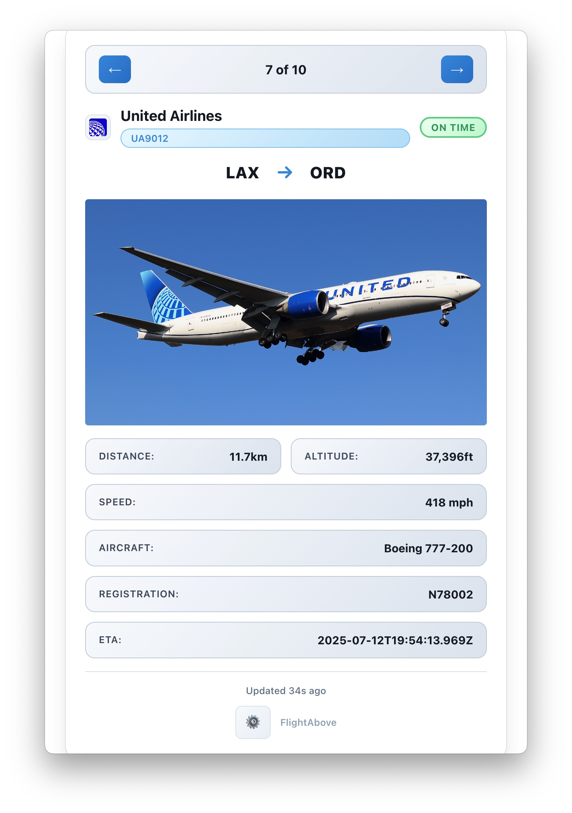

# FlightAbove

[](https://github.com/LouisXO/FlightAbove/actions)
[](LICENSE)
[](https://github.com/LouisXO/FlightAbove/releases)
[](https://www.apple.com/macos/)
[](https://github.com/LouisXO/FlightAbove/stargazers)
[](https://github.com/LouisXO/FlightAbove/network/members)

A modern macOS menu bar application that displays nearby aircraft with real-time flight information, comprehensive credit management, and a beautiful interface designed for aviation enthusiasts.



## ✨ Features

- **Real-Time Flight Tracking** - Detect aircraft within 10-50km radius
- **Aircraft Images** - View real photos of detected aircraft via JetAPI
- **Rich Flight Data** - Flight numbers, airlines, routes, altitude, speed
- **1,224+ Airlines** - Global coverage with professional logos
- **Demo Mode** - Test without API keys using realistic flight data
- **Smart Caching** - Efficient performance with intelligent data caching
- **Native macOS UI** - Clean, minimalist menu bar interface

## 🚀 Quick Start

### For Users
1. Download the latest release from [Releases](https://github.com/LouisXO/FlightAbove/releases)
2. Open the DMG and drag to Applications
3. **If you see "FlightAbove Is Damaged" error**, run this command in Terminal:
   ```bash
   xattr -c /Applications/FlightAbove.app
   ```
4. Launch FlightAbove from your menu bar

### For Developers
```bash
git clone https://github.com/LouisXO/FlightAbove.git
cd FlightAbove
npm install
npm run dev
```

## 📋 Requirements

- macOS 10.14 or later
- Internet connection
- IP-based location services (no GPS required)

## 🎮 Usage

1. **Launch** FlightAbove from Applications
2. **Click** the menu bar icon to view nearby aircraft
3. **Navigate** through multiple flights with arrow keys
4. **View** comprehensive flight information and aircraft images
5. **Configure** settings via the gear icon

### Menu Bar Indicators
- ✈️ - No flights detected
- UA1234 - Single flight (shows flight number)
- UA1234+2 - Multiple flights (shows closest + count)

## 🛠️ Development

### Scripts
```bash
npm run dev          # Start development environment
npm run build        # Build for production
npm run dist         # Package for distribution
npm run lint         # Run linting
./scripts/version.sh patch  # Bump version
```

### Tech Stack
- **Frontend**: React 18 + TypeScript
- **Backend**: Electron
- **Build**: Vite
- **APIs**: FlightRadar24, JetAPI

## 🔧 Troubleshooting

### "FlightAbove Is Damaged" Error
If you see this error when trying to open the app:

```
"FlightAbove" is damaged and can't be opened. You should move it to the Trash.
```

**Solution**: Run this command in Terminal:
```bash
xattr -c /Applications/FlightAbove.app
```

This removes the quarantine attribute that macOS adds to unsigned apps downloaded from the internet.

### Why This Happens
- macOS Gatekeeper blocks unsigned apps by default
- The app is not code-signed (no developer certificate)
- This is normal for open-source Electron apps
- The `xattr -c` command removes the quarantine flag

## 🤝 Contributing

1. Fork the repository
2. Create a feature branch
3. Make your changes
4. Test with demo mode
5. Submit a pull request

## 📄 License

MIT License - see [LICENSE](LICENSE) for details.

## 🙏 Acknowledgements

- [JetAPI](https://github.com/macsencasaus/jetapi) - Aircraft images
- [JetPhotos.com](https://www.jetphotos.com/) - Image source
- [FlightRadarAPI](https://github.com/JeanExtreme002/FlightRadarAPI) - Flight data
- [Airline Repo](https://github.com/dotmarn/Airlines) - Airline logos

## ☕ Support

If you enjoy FlightAbove, consider buying me a coffee:

[](https://www.buymeacoffee.com/louisleng)

---

**Made with ❤️ for aviation enthusiasts worldwide**

