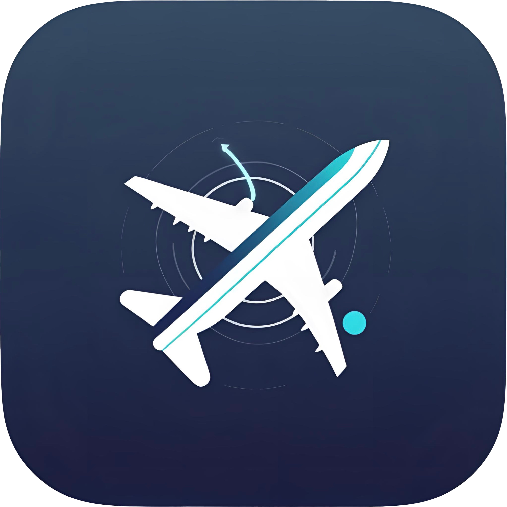

# FlightAbove

A macOS menu bar application that displays nearby aircraft with real-time flight information, airline logos, and detailed flight data.



## 🚀 Features

### ✈️ Real-Time Flight Tracking
- **Multiple Flight Display**: Shows up to 10 nearby aircraft within 100km radius
- **Flight Navigation**: Browse through detected flights with next/previous controls
- **Distance Calculation**: Displays exact distance to each aircraft
- **Live Updates**: Automatic refresh every 30 seconds

### 🎯 Rich Flight Information
- **Comprehensive Data**: Flight number, airline, origin/destination airports (IATA/ICAO)
- **Aircraft Details**: Aircraft type, registration number, altitude, speed, heading
- **Real-Time Status**: Current position, vertical speed, estimated arrival time
- **Route Information**: Complete flight path with airport codes

### 🏢 Airline Integration
- **Authentic Logos**: Real airline SVG logos from [soaring-symbols](https://github.com/anhthang/soaring-symbols) repository
- **Smart Caching**: Efficient logo caching system with fallback handling
- **Global Coverage**: Support for major international airlines
- **Automatic Detection**: Intelligent airline code extraction from flight data

### 🖥️ Native macOS Experience
- **Menu Bar Integration**: Clean, unobtrusive menu bar presence
- **Click-Away Behavior**: Window closes when clicking outside (native macOS behavior)
- **Responsive Design**: Optimized 450x300 window with proper scaling
- **Right-Click Settings**: Easy access to configuration via context menu

### ⚙️ Configuration & Settings
- **API Key Management**: Secure storage of FlightRadar24 API credentials
- **Settings Panel**: Intuitive configuration interface
- **Location Services**: Automatic IP-based geolocation with fallback services
- **Privacy-First**: Minimal data collection, secure credential storage

## 📋 Requirements

- **macOS**: Version 10.14 or later
- **FlightRadar24 API Key**: Required for real flight data (see setup guide)
- **Internet Connection**: For flight data and airline logos

## 🛠️ Installation

### From Source
```bash
# Clone the repository
git clone https://github.com/LouisXO/FlightAbove.git
cd FlightAbove

# Install dependencies
npm install

# Build the application
npm run build

# Run the application
npm start
```

### Development Mode
```bash
# Start development servers
npm run dev

# Build for production
npm run build

# Package for distribution
npm run package
```

## 🔧 Setup

### 1. FlightRadar24 API Key
1. Visit [FlightRadar24 API](https://fr24api.flightradar24.com/)
2. Create an account and obtain an API key
3. Launch FlightAbove and right-click the menu bar icon
4. Select "Settings" and enter your API key
5. Click "Save" to store securely

### 2. Location Permissions
The app uses IP-based geolocation services and doesn't require macOS location permissions.

## 🎮 Usage

### Basic Operation
1. **Launch**: Start FlightAbove from Applications or via `npm start`
2. **View Flights**: Click the menu bar icon to see nearby aircraft
3. **Navigate**: Use ← → arrows to browse through multiple flights
4. **Details**: View comprehensive flight information for each aircraft
5. **Settings**: Right-click menu bar icon for configuration options

### Flight Information Display
- **Airline**: Company name with authentic logo
- **Flight Number**: Full flight identification
- **Route**: Origin → Destination with airport codes
- **Aircraft**: Type, registration, and distance
- **Status**: Altitude, speed, heading, and ETA

### Menu Bar States
- **🛩️ No flights nearby**: No aircraft detected within range
- **✈️ [Count] flights nearby**: Multiple aircraft detected
- **🔵 UA1234**: Single flight overhead (example)

## 🛡️ Privacy & Security

### Data Handling
- **API Keys**: Encrypted storage using macOS keychain
- **Location**: IP-based geolocation only, no GPS tracking
- **Flight Data**: Temporary caching, no permanent storage
- **No Analytics**: No usage tracking or data collection

### Security Features
- **Secure Storage**: API credentials encrypted at rest
- **HTTPS Only**: All network requests use secure connections
- **Minimal Permissions**: Only requests necessary system access
- **Open Source**: Full source code available for review

## 🔍 Troubleshooting

### Common Issues

#### No Flights Detected
- **Check API Key**: Ensure FlightRadar24 API key is entered correctly
- **Verify Location**: Confirm your location is detected properly
- **Flight Density**: Try different times of day or locations with more air traffic

#### Airline Logos Not Loading
- **Internet Connection**: Verify connectivity for logo downloads
- **Repository Status**: Check if [soaring-symbols](https://github.com/anhthang/soaring-symbols) is accessible
- **Cache Reset**: Clear logo cache in settings if needed

#### App Not Starting
- **Dependencies**: Run `npm install` to ensure all packages are installed
- **Build Process**: Execute `npm run build` to compile the application
- **Permissions**: Check macOS security settings for unsigned applications

### Debug Information
Enable debug logging by setting the environment variable:
```bash
DEBUG=flight-above npm start
```

## 🏗️ Architecture

### Technology Stack
- **Frontend**: React 18 with TypeScript
- **Backend**: Electron with Node.js
- **Build System**: Vite for fast development
- **UI**: Custom CSS with responsive design
- **APIs**: FlightRadar24 for flight data

### Key Components
- **FlightService**: Handles API communication and flight data processing
- **LocationService**: Manages IP-based geolocation
- **ApiKeyManager**: Secure credential storage and logo caching
- **App Component**: Main UI with flight display and navigation

### Data Flow
1. **Location Detection**: IP-based geolocation determines user position
2. **Flight Query**: API request to FlightRadar24 for nearby aircraft
3. **Data Processing**: Flight information parsing and distance calculation
4. **Logo Fetching**: Airline logo retrieval and caching
5. **UI Update**: Display refresh with new flight data

## 🤝 Contributing

### Development Setup
1. Fork the repository
2. Create a feature branch
3. Install dependencies: `npm install`
4. Start development: `npm run dev`
5. Make changes and test thoroughly
6. Submit a pull request

### Code Style
- **TypeScript**: Strict typing enabled
- **ESLint**: Automated linting and formatting
- **Prettier**: Consistent code formatting
- **Testing**: Jest for unit tests (planned)

### Areas for Contribution
- **Additional Airlines**: Expanding airline logo mappings
- **UI Improvements**: Enhanced user interface components
- **Performance**: Optimization and caching improvements
- **Features**: New functionality and user experience enhancements

## 📄 License

This project is licensed under the MIT License - see the [LICENSE](LICENSE) file for details.

## 🙏 Acknowledgments

- **[soaring-symbols](https://github.com/anhthang/soaring-symbols)**: Airline logo SVG collection
- **[FlightRadar24](https://www.flightradar24.com/)**: Real-time flight data API
- **[menubar](https://github.com/maxogden/menubar)**: macOS menu bar integration
- **Electron Community**: For the excellent desktop app framework

## 📊 Current Status

### ✅ Completed Features
- Multi-flight display with navigation
- Real airline logos from soaring-symbols
- Comprehensive flight information
- Secure API key management
- Native macOS menu bar integration
- Settings panel with configuration options
- IP-based geolocation services
- Smart caching system
- Error handling and fallbacks

### 🚧 In Development
- Auto-updater system
- Enhanced error messages
- Performance optimizations
- Additional airline mappings

### 🔮 Planned Features
- Historical flight data
- Custom alert system
- Weather integration
- Export functionality
- Widget customization

---

**Version**: 1.0.0  
**Last Updated**: July 2025  
**Maintained by**: Louis Leng
