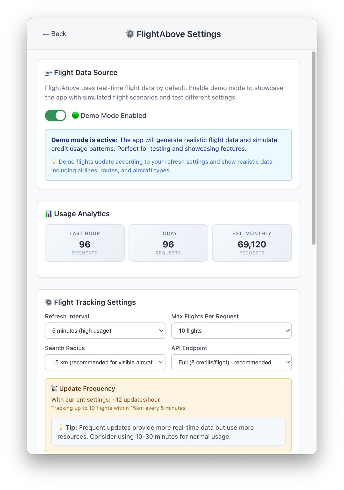

# FlightAbove

A modern macOS menu bar application that displays nearby aircraft with real-time flight information, comprehensive credit management, and a beautiful interface designed for aviation enthusiasts.


## 📖 Description

FlightAbove transforms your Mac's menu bar into a sophisticated aviation radar, showing you exactly what aircraft are flying nearby. With an elegant interface and comprehensive flight data, discover detailed information about flights overhead - from commercial airliners to private aircraft. Features intelligent credit management to optimize FlightRadar24 API costs while providing rich flight information.

**Perfect for aviation enthusiasts, frequent travelers, and anyone curious about the sky above them.**

## ✨ Screenshots

| Main Flight Display | Settings & Configuration |
|---------------------|-------------------------|
|  |  |

## 🚀 Key Features

### ✈️ Real-Time Flight Tracking
- **Smart Flight Detection**: Displays nearby aircraft within configurable radius (20-500km)
- **Multiple Flight Navigation**: Browse through detected flights with elegant navigation controls
- **Live Distance Calculation**: Shows exact distance to each aircraft with precision
- **Intelligent Updates**: Configurable refresh intervals (5-60 minutes) for optimal API usage

### 💳 Advanced Credit Management
- **Usage Analytics**: Real-time tracking of API credit consumption (hourly, daily, monthly)
- **Cost Optimization**: Intelligent settings to minimize FlightRadar24 API expenses
- **Plan Recommendations**: Smart suggestions for Explorer ($9), Essential ($90), or Advanced ($900) plans
- **Conservative Defaults**: Ultra-conservative settings (30-min intervals, 1 flight max, 20km radius)

### 🎮 Demo Mode
- **Realistic Simulation**: Generate authentic flight data without API costs
- **Perfect for Testing**: Showcase features and test functionality
- **Full Feature Access**: Credit tracking, analytics, and UI testing
- **Multiple Aircraft**: Demonstrates navigation with 2-4+ realistic flights

### 🎯 Rich Flight Information
- **Comprehensive Data**: Flight number, airline, origin/destination airports (IATA codes)
- **Aircraft Details**: Type, registration number, altitude, speed, heading
- **Real-Time Status**: Current position, flight status (On Time/Delayed/Cancelled)
- **Route Visualization**: Clean route display with airport codes and status indicators

### 🏢 Airline Integration
- **Authentic Branding**: Real airline logos with smart fallback handling
- **Global Coverage**: Support for major international airlines (United, American, Delta, Southwest, JetBlue, etc.)
- **Intelligent Detection**: Automatic airline code extraction from flight callsigns
- **Visual Excellence**: Polished logo presentation with proper sizing and styling

### 🖥️ Modern macOS Experience
- **Beautiful Design**: Modern gradient backgrounds with sophisticated color palette
- **Clean Interface**: Elegant cards, smooth animations, and intuitive navigation
- **Native Behavior**: Proper menu bar integration with click-away functionality
- **Fixed Window Size**: Optimized 500x600 window that fits perfectly on any screen
- **Responsive Design**: Fluid layouts that adapt to content

### ⚙️ Advanced Configuration
- **Secure API Management**: Encrypted FlightRadar24 API key storage
- **Comprehensive Settings**: Fine-tune refresh intervals, flight limits, search radius
- **Endpoint Selection**: Choose between Light (6 credits) or Full (8 credits) endpoints
- **Error Handling**: Intelligent API error detection with user-friendly messages
- **Usage Monitoring**: Real-time credit consumption tracking and cost estimates

## 📋 Requirements

- **macOS**: Version 10.14 or later
- **FlightRadar24 API Key**: Required for real flight data (Explorer plan: $9/month recommended)
- **Internet Connection**: For flight data and airline logos
- **Location Services**: IP-based geolocation (no GPS permissions required)

## 🛠️ Installation

### Quick Start
```bash
# Clone the repository
git clone https://github.com/LouisXO/FlightAbove.git
cd FlightAbove

# Install dependencies
npm install

# Start the application
npm start
```

### Development Mode
```bash
# Start development environment
npm run dev

# Build for production
npm run build

# Package for distribution
npm run package
```

## 🔧 Setup Guide

### 1. FlightRadar24 API Key Setup
1. **Get API Key**: Visit [FlightRadar24 API](https://fr24api.flightradar24.com/) and create an account
2. **Choose Plan**: 
   - **Explorer**: $9/month (60K credits) - Perfect for casual use
   - **Essential**: $90/month (660K credits) - Heavy usage
   - **Advanced**: $900/month (4M+ credits) - Commercial use
3. **Configure App**: 
   - Launch FlightAbove
   - Click settings gear icon or right-click menu bar → Settings
   - Enter your API key in the configuration section
   - Click "Save API Key"

### 2. Optimize Credit Usage
The app includes intelligent defaults to minimize costs:
- **Refresh Interval**: 30 minutes (vs. 1 minute alternatives)
- **Flight Limit**: 1 flight per request (vs. 10+ options)
- **Search Radius**: 20km (vs. 500km maximum)
- **Endpoint**: Full data (8 credits) for complete information

**Estimated Usage**: ~11,520 credits/month (19% of Explorer plan)

### 3. Demo Mode (No API Key Required)
1. **Enable Demo**: Toggle the "Demo Mode" switch in settings
2. **Instant Results**: Generates 2-4 realistic flights immediately
3. **Full Features**: Test all functionality including credit tracking
4. **Perfect for**: Testing, demonstrations, development

## 🎮 Usage Guide

### Basic Operation
1. **Launch**: Start FlightAbove from Applications or via terminal
2. **View Flights**: Click the menu bar icon to see nearby aircraft
3. **Navigate Multiple Flights**: Use ← → arrows to browse through flights
4. **Flight Details**: View comprehensive information for each aircraft
5. **Settings Access**: Click gear icon or right-click menu bar for configuration

### Flight Information Display
Each flight shows:
- **Airline**: Company name with authentic logo
- **Flight Number**: Full flight identification (e.g., UA1234)
- **Route**: Origin → Destination with IATA airport codes
- **Distance**: Exact distance from your location
- **Aircraft**: Type, registration number
- **Flight Data**: Altitude, speed, status
- **ETA**: Estimated arrival time

### Menu Bar Indicators
- **✈️**: No flights detected nearby
- **UA1234**: Single flight overhead (shows flight number)
- **UA1234+2**: Multiple flights (shows closest + count)
- **✈️💥**: Error occurred (will retry automatically)

### Credit Management
Monitor your API usage:
- **Real-time Tracking**: See credits used this hour/day
- **Monthly Estimates**: Projected monthly consumption
- **Plan Recommendations**: Optimal subscription suggestions
- **Cost Calculator**: Impact of different settings

## 🛡️ Privacy & Security

### Data Protection
- **API Keys**: Stored securely using macOS Keychain encryption
- **Location Privacy**: Uses IP-based geolocation only (no GPS tracking)
- **Minimal Data**: Flight information cached temporarily, not stored permanently
- **No Analytics**: Zero usage tracking or personal data collection

### Security Features
- **Encrypted Storage**: All credentials encrypted at rest
- **HTTPS Only**: All network communications use secure connections
- **Open Source**: Full transparency with publicly available code
- **Minimal Permissions**: Requests only necessary system access

## 🎨 Design Philosophy

### Modern Interface
- **Light Blue Gradient**: Beautiful sky-themed background
- **Card-Based Layout**: Clean, organized information presentation
- **Smooth Animations**: Subtle hover effects and transitions
- **Typography**: Clear hierarchy with excellent readability
- **Color-Coded Status**: Visual indicators for flight status (On Time, Delayed, etc.)

### User Experience
- **Instant Feedback**: Immediate responses to user interactions
- **Intuitive Navigation**: Natural flow between flights and settings
- **Error Handling**: Friendly error messages with actionable solutions
- **Performance**: Optimized for minimal resource usage

## 🔍 Troubleshooting

### Common Issues

#### No Flights Detected
- **Verify API Key**: Ensure your FlightRadar24 API key is entered correctly
- **Check Credits**: Confirm you have sufficient API credits remaining
- **Try Demo Mode**: Enable demo mode to test functionality
- **Increase Radius**: Expand search radius in settings for more coverage

#### Credit/Cost Concerns
- **Use Conservative Settings**: 30-minute intervals, 1 flight max, 20km radius
- **Monitor Usage**: Check daily/monthly consumption in settings
- **Consider Demo Mode**: Use for testing without consuming credits
- **Explorer Plan**: $9/month plan sufficient for most users

#### API Errors
- **402 Payment Required**: Top up your FlightRadar24 account credits
- **401 Invalid Key**: Verify your API key is correct and active
- **Rate Limits**: Increase refresh interval to reduce request frequency
- **Network Issues**: Check internet connection and retry

### Debug Mode
Enable detailed logging:
```bash
DEBUG=flight-above npm start
```

## 🏗️ Technical Architecture

### Technology Stack
- **Frontend**: React 18 with TypeScript for type safety
- **Backend**: Electron for native macOS integration
- **Build System**: Vite for fast development and optimized builds
- **Styling**: Custom CSS with modern design patterns
- **APIs**: FlightRadar24 for real-time flight data

### Key Components
- **FlightService**: API communication, flight data processing, credit tracking
- **LocationService**: IP-based geolocation with fallback services
- **ApiKeyManager**: Secure credential storage and management
- **SettingsPanel**: Comprehensive configuration interface
- **Credit Analytics**: Usage tracking and cost optimization

### Modern Features
- **Smart Caching**: Efficient data and logo caching strategies
- **Error Recovery**: Automatic retry mechanisms for API failures
- **Resource Optimization**: Minimal CPU and memory usage
- **Background Updates**: Non-blocking flight data refreshes

## 🤝 Contributing

### Development Setup
1. **Fork Repository**: Create your own fork on GitHub
2. **Clone Locally**: `git clone https://github.com/your-username/FlightAbove.git`
3. **Install Dependencies**: `npm install`
4. **Start Development**: `npm run dev`
5. **Test Changes**: Use demo mode for testing without API costs

### Contribution Areas
- **UI/UX Improvements**: Enhanced designs and user interactions
- **Additional Airlines**: Expanding airline support and logo coverage
- **Performance Optimization**: Caching and efficiency improvements
- **New Features**: Creative functionality additions
- **Documentation**: Improved guides and examples

### Code Standards
- **TypeScript**: Strict typing for reliability
- **Modern React**: Hooks and functional components
- **Clean Architecture**: Well-organized, maintainable code
- **Comprehensive Comments**: Clear documentation

## 📊 API Usage Optimization

### Cost-Effective Settings
| Setting | Conservative | Balanced | Aggressive |
|---------|-------------|----------|------------|
| **Refresh** | 30 min | 10 min | 5 min |
| **Flights** | 1 | 3 | 5 |
| **Radius** | 20km | 100km | 200km |
| **Monthly Credits** | ~11K | ~50K | ~200K+ |
| **Plan Needed** | Explorer | Explorer/Essential | Essential+ |

### Usage Examples
- **Casual Aviation Fan**: Conservative settings (~11K credits/month)
- **Aviation Enthusiast**: Balanced settings (~50K credits/month)  
- **Professional Use**: Aggressive settings (200K+ credits/month)

## 📄 License

This project is licensed under the MIT License - see the [LICENSE](LICENSE) file for details.

## 🙏 Acknowledgments

- **FlightRadar24**: Real-time flight data API
- **Airline Logos**: Various airlines for branding assets
- **Open Source Community**: Libraries and tools that make this possible
- **Aviation Community**: Inspiration and feedback

---

**Made with ❤️ for aviation enthusiasts worldwide**
